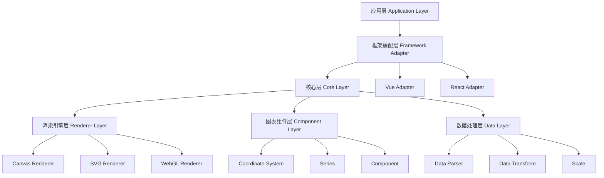

# 图表库架构设计方案

## 项目概述

打造一个高性能、可扩展的现代化图表库，对标并超越 ECharts 和 VChart，支持丰富的图表类型、双渲染引擎（Canvas/SVG）、主题系统和插件化架构。

## 技术栈

- **语言**: TypeScript 5.x
- **包管理**: pnpm + workspace
- **构建工具**: Vite
- **目标环境**: 现代浏览器 (ES2020+)
- **3D 支持**: 预留 WebGL 扩展能力

## 项目结构

```
chart/
├── packages/
│   ├── core/                    # 核心库（框架无关）
│   ├── vue/                     # Vue 适配器
│   ├── react/                   # React 适配器（可选）
│   ├── renderer-canvas/         # Canvas 渲染器
│   ├── renderer-svg/            # SVG 渲染器
│   ├── renderer-webgl/          # WebGL 渲染器（3D）
│   ├── charts-basic/            # 基础图表包
│   ├── charts-statistical/      # 统计图表包
│   ├── charts-relationship/     # 关系图表包
│   └── charts-geo/              # 地理图表包
├── docs/                        # 文档站点
├── scripts/                     # 构建脚本
└── pnpm-workspace.yaml
```

## 核心架构层次



## 核心模块设计

### 1. 渲染引擎抽象层

统一渲染接口，支持多种渲染引擎切换：

- **IRenderer**: 渲染器接口
- **CanvasRenderer**: Canvas 2D 渲染实现
- **SVGRenderer**: SVG DOM 渲染实现
- **WebGLRenderer**: WebGL 3D 渲染实现

### 2. 图表核心类

- **Chart**: 图表主类，管理整个图表生命周期
- **CoordinateSystem**: 坐标系统（笛卡尔、极坐标、地理等）
- **Series**: 系列类（折线、柱状、饼图等）
- **Component**: 组件类（坐标轴、图例、提示框等）

### 3. 数据处理流程

原始数据 → 数据解析 → 数据转换 → 比例尺映射 → 布局计算 → 渲染

### 4. 插件系统

支持通过插件扩展功能，包括：
- 自定义图表类型
- 自定义组件
- 数据转换器
- 交互行为
- 工具集成

### 5. 主题系统

- 内置多套主题（亮色、暗色等）
- 支持主题定制
- 主题动态切换
- 组件级主题覆盖

### 6. 动画系统

- 基于 requestAnimationFrame
- 支持多种缓动函数
- 状态过渡动画
- 自定义动画轨迹

### 7. 事件系统

- 统一事件管理
- 支持鼠标、触摸事件
- 事件代理和冒泡
- 自定义事件

## 包设计详情

### @ldesign/chart-core

核心包，包含所有框架无关的功能：

**目录结构**:
```
packages/core/src/
├── chart/              # 图表核心
├── renderer/           # 渲染器接口
├── component/          # 组件系统
├── series/             # 系列类型
├── coordinate/         # 坐标系统
├── scale/              # 比例尺
├── layout/             # 布局引擎
├── animation/          # 动画系统
├── interaction/        # 交互系统
├── theme/              # 主题系统
├── plugin/             # 插件系统
├── data/               # 数据处理
├── event/              # 事件系统
├── util/               # 工具函数
└── types/              # 类型定义
```

### @ldesign/chart-vue

Vue 框架适配器：

**功能**:
- Vue 组件封装
- 响应式数据绑定
- 组合式 API (Composables)
- Vue 3 最佳实践

**目录结构**:
```
packages/vue/src/
├── components/
│   ├── Chart.vue       # 通用图表组件
│   ├── LineChart.vue   # 折线图组件
│   ├── BarChart.vue    # 柱状图组件
│   └── ...
├── composables/
│   ├── useChart.ts     # 图表 Hook
│   ├── useTheme.ts     # 主题 Hook
│   └── ...
└── types/
```

## 渲染器包设计

### @ldesign/chart-renderer-canvas

Canvas 渲染器实现，特点：
- 高性能
- 适合大数据量场景
- 支持像素级操作

### @ldesign/chart-renderer-svg

SVG 渲染器实现，特点：
- 矢量图形
- 适合打印
- DOM 操作友好
- 支持 CSS 样式

### @ldesign/chart-renderer-webgl

WebGL 渲染器实现，特点：
- 3D 图表支持
- GPU 加速
- 超大数据量渲染

## 图表类型包设计

### @ldesign/chart-basic

基础图表类型：
- 折线图 (Line)
- 柱状图 (Bar)
- 饼图 (Pie)
- 散点图 (Scatter)
- 面积图 (Area)
- 雷达图 (Radar)

### @ldesign/chart-statistical

统计图表类型：
- 箱线图 (Boxplot)
- 热力图 (Heatmap)
- 漏斗图 (Funnel)
- 仪表盘 (Gauge)
- K线图 (Candlestick)

### @ldesign/chart-relationship

关系图表类型：
- 关系图 (Graph)
- 树图 (Tree)
- 矩形树图 (Treemap)
- 旭日图 (Sunburst)
- 桑基图 (Sankey)

### @ldesign/chart-geo

地理图表类型：
- 地图 (Map)
- 地理坐标系散点图
- 热力地图
- 路径图

## 性能优化策略

### 1. 渲染优化
- 脏检查机制，只更新变化部分
- 离屏渲染（Canvas）
- 虚拟滚动（大数据量）
- 分层渲染

### 2. 数据优化
- 数据抽样（downsampling）
- 增量更新
- Web Worker 数据处理
- 数据缓存

### 3. 交互优化
- 事件代理
- 防抖和节流
- 碰撞检测优化（四叉树、空间索引）

### 4. 内存优化
- 对象池复用
- 及时释放资源
- 弱引用使用

## 扩展性设计

### 1. 插件机制
```typescript
interface Plugin {
  name: string
  install(chart: Chart): void
  uninstall?(chart: Chart): void
}
```

### 2. 自定义系列
继承 `Series` 基类实现自定义图表类型

### 3. 自定义组件
继承 `Component` 基类实现自定义组件

### 4. 自定义渲染器
实现 `IRenderer` 接口支持新的渲染方式

## 开发工具链

### 构建配置
- Vite 作为开发服务器和构建工具
- TypeScript 严格模式
- 代码分割和 Tree-shaking

### 代码质量
- ESLint + Prettier 代码规范
- Husky + lint-staged Git Hooks
- Commitlint 提交规范

### 测试
- Vitest 单元测试
- Playwright 端到端测试
- 视觉回归测试

### 文档
- VitePress 文档站点
- API 自动生成文档
- 在线示例 Playground

## 版本发布策略

- 采用语义化版本 (Semver)
- Changesets 管理版本和 Changelog
- 自动化 CI/CD 流程
- NPM 包发布

## 对比分析

### vs ECharts
**优势**:
- 更现代的架构设计
- TypeScript 原生支持
- 更灵活的插件系统
- 更好的 Tree-shaking
- 更小的包体积

### vs VChart
**优势**:
- 更丰富的图表类型
- 多渲染引擎支持
- 更强的扩展性
- 更完善的框架集成

## 实施路线图

### Phase 1: 基础架构（1-2个月）
- 搭建 monorepo 项目结构
- 实现核心渲染引擎抽象
- 实现基础坐标系统
- 实现事件和动画系统

### Phase 2: 基础图表（2-3个月）
- 实现折线图、柱状图、饼图
- 实现基础组件（坐标轴、图例、提示框）
- 实现主题系统
- Vue 适配器开发

### Phase 3: 高级功能（2-3个月）
- 实现插件系统
- 更多图表类型
- 数据转换和处理
- 性能优化

### Phase 4: 生态完善（持续）
- 文档和示例
- 更多框架适配器
- 社区插件
- 工具生态